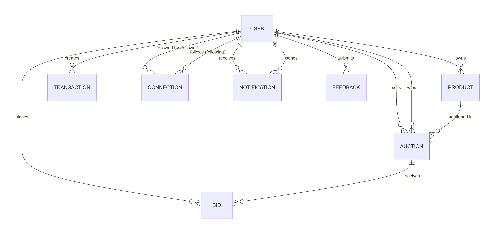

# Database Schema Design

This document outlines the structure of the database entities based on the domain-driven design implemented in the codebase. 

## Entity Relationship Diagram

---

## Entities Overview

### 1. User (`users` table)
The central entity of the system, representing both standard users and administrators.

| Field               | Type       | Constraints / Description    |
| :------------------ | :--------- | :--------------------------- |
| `id`                | Long       | Primary Key (Auto Increment) |
| `username`          | String     | Not Null                     |
| `email`             | String     | Not Null, Unique             |
| `password`          | String     | Hashed password              |
| `profile_image_url` | String     | URL to CDN                   |
| `provider`          | Enum       | `LOCAL`, `GOOGLE`, etc.      |
| `role`              | Enum       | `USER`, `ADMIN`              |
| `enabled`           | boolean    | Account status               |
| `balance`           | BigDecimal | Precision 19,2; Default 0.00 |

**Relationships:**
* `1-to-Many` with **Product** (`myStorage`)
* `1-to-Many` with **Auction** (`myAuction`, `myReward`)
* `1-to-Many` with **Transaction** (`transactions`)
* `1-to-Many` with **Connection** (`followers`, `following`)
* `1-to-Many` with **Feedback** (`myFeedback`)

---

### 2. Product (`products` table)
Items that users add to their storage before launching an auction.

| Field               | Type      | Constraints / Description                 |
| :------------------ | :-------- | :---------------------------------------- |
| `id`                | Long      | Primary Key (Auto Increment)              |
| `product_name`      | String    | Not Null                                  |
| `description`       | String    | TEXT, Not Null                            |
| `quantity`          | int       | Not Null                                  |
| `product_image_url` | String    | Max length 1024                           |
| `tags`              | Set<Enum> | Stored in `product_tags` collection table |
| `created_at`        | DateTime  | Not Null, Updatable=false                 |

**Relationships:**
* `Many-to-1` with **User** (`owner`)
* `1-to-Many` with **Auction** (`auctions`)

---

### 3. Auction (`auctions` table)
Represents a launched bidding event for a specific product.

| Field               | Type       | Constraints / Description                           |
| :------------------ | :--------- | :-------------------------------------------------- |
| `id`                | Long       | Primary Key (Auto Increment)                        |
| `auctionedQuantity` | int        | Not Null                                            |
| `startingPrice`     | BigDecimal | Not Null, Precision 15,2                            |
| `currentPrice`      | BigDecimal | Not Null, Precision 15,2                            |
| `minBidIncrement`   | BigDecimal | Not Null, Precision 15,2 (Calculated automatically) |
| `startTime`         | Instant    | Not Null                                            |
| `endTime`           | Instant    | Not Null                                            |
| `status`            | Enum       | `UPCOMING`, `ACTIVE`, `ENDED`                       |
| `bidCount`          | int        | Default 0                                           |
| `extended`          | boolean    | Default false (used for anti-sniping)               |

**Relationships:**
* `Many-to-1` with **User** (`seller`)
* `Many-to-1` with **User** (`winner`, nullable)
* `Many-to-1` with **Product** (`product`)

---

### 4. Bid (`bids` table)
Records a bid placed by a user on an auction.

| Field      | Type       | Constraints / Description         |
| :--------- | :--------- | :-------------------------------- |
| `id`       | Long       | Primary Key (Auto Increment)      |
| `amount`   | BigDecimal | Not Null, Precision 15,2          |
| `status`   | Enum       | `PENDING`, `ACCEPTED`, `REJECTED` |
| `placedAt` | Instant    | Not Null                          |

**Relationships:**
* `Many-to-1` with **Auction** (`auction`)
* `Many-to-1` with **User** (`bidder`)

---

### 5. Transaction (`transactions` table)
Handles wallet deposits and withdrawals.

| Field        | Type       | Constraints / Description                 |
| :----------- | :--------- | :---------------------------------------- |
| `id`         | Long       | Primary Key (Auto Increment)              |
| `amount`     | BigDecimal | Not Null, Precision 19,4                  |
| `type`       | Enum       | Transaction Type (e.g. DEPOSIT, WITHDRAW) |
| `status`     | Enum       | `PENDING`, `SUCCESS`, `FAILED`            |
| `created_at` | DateTime   | Not Null, Updatable=false                 |

**Relationships:**
* `Many-to-1` with **User** (`user`)

---

### 6. Connection (`connections` table)
Represents the followers/following relationships between users.

| Field       | Type     | Constraints / Description    |
| :---------- | :------- | :--------------------------- |
| `id`        | Long     | Primary Key (Auto Increment) |
| `follow_at` | DateTime | Default to now()             |

**Relationships:**
* `Many-to-1` with **User** (`follower`)
* `Many-to-1` with **User** (`following`)

---

### 7. Notification (`notifications` table)
Stores system and user notifications.

| Field               | Type     | Constraints / Description    |
| :------------------ | :------- | :--------------------------- |
| `id`                | Long     | Primary Key (Auto Increment) |
| `notification_type` | Enum     | Type of notification         |
| `message`           | String   | TEXT, Not Null               |
| `created_at`        | DateTime | Not Null                     |
| `has_read`          | boolean  | Default false                |

**Relationships:**
* `Many-to-1` with **User** (`receiver`)
* `Many-to-1` with **User** (`sender`)

---

### 8. Feedback (`feedbacks` table)
Used by clients to submit feedback, which admins can respond to.

| Field            | Type     | Constraints / Description    |
| :--------------- | :------- | :--------------------------- |
| `id`             | Long     | Primary Key (Auto Increment) |
| `content`        | String   | TEXT, Not Null               |
| `admin_response` | String   | TEXT                         |
| `created_at`     | DateTime | Not Null, Updatable=false    |

**Relationships:**
* `Many-to-1` with **User** (`client`)

---

### 9. RefreshToken (`refresh_tokens` table)
Used for managing JWT refresh tokens. Note: Linked to User via `userId` column instead of an explicit foreign key object relation in the domain model.

| Field       | Type   | Constraints / Description    |
| :---------- | :----- | :--------------------------- |
| `id`        | Long   | Primary Key (Auto Increment) |
| `token`     | String | Not Null, Unique             |
| `userId`    | Long   | Not Null                     |
| `ipAddress` | String | Max length 45                |
| `userAgent` | String | TEXT                         |
| `createdAt` | Date   | Not Null                     |
| `expiresAt` | Date   | Not Null                     |
