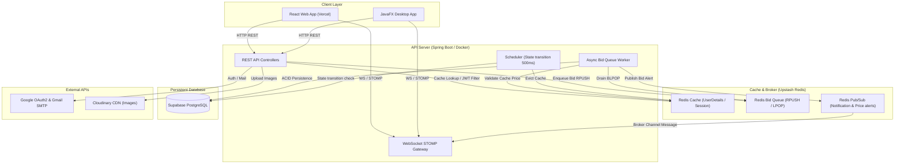
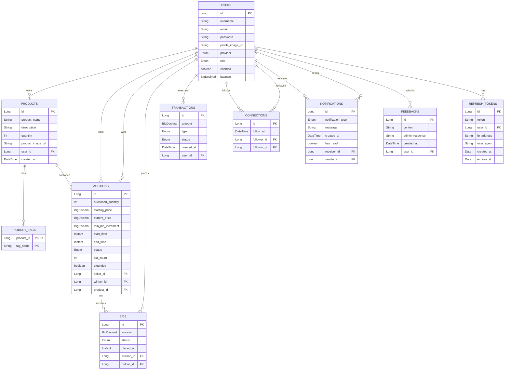
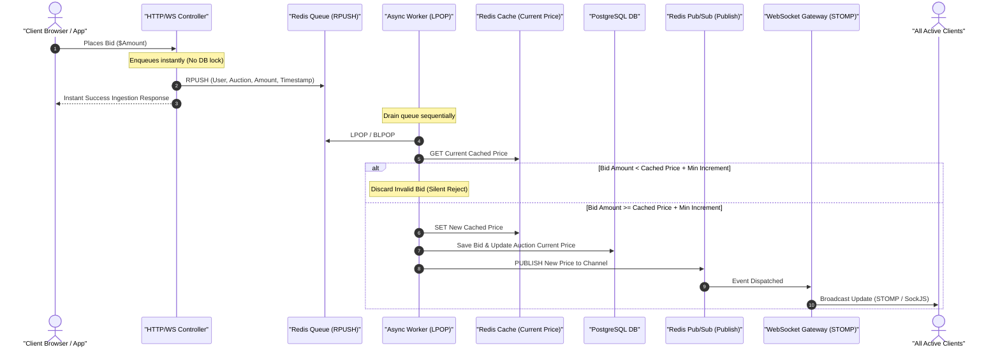

<div align="center">

```
██████╗ ██╗██████╗     ██╗   ██╗ █████╗ ██╗   ██╗██╗  ████████╗
██╔══██╗██║██╔══██╗    ██║   ██║██╔══██╗██║   ██║██║  ╚══██╔══╝
██████╔╝██║██║  ██║    ██║   ██║███████║██║   ██║██║     ██║   
██╔══██╗██║██║  ██║    ╚██╗ ██╔╝██╔══██║██║   ██║██║     ██║   
██████╔╝██║██████╔╝     ╚████╔╝ ██║  ██║╚██████╔╝███████╗██║   
╚═════╝ ╚═╝╚═════╝       ╚═══╝  ╚═╝  ╚═╝ ╚═════╝ ╚══════╝╚═╝   
```

### *Where every bid tells a story.*


**[Live Demo](https://bid-vault-seven.vercel.app/)** &nbsp;•&nbsp; **[Main Repository](https://github.com/lkishere2/BidVault)** &nbsp;•&nbsp; **[Deployment Fork](https://github.com/2cpk-fin/BidVault)**

</div>

---

## 1. Problem Description and System Scope

* **Problem:** Traditional physical auctions are limited by geography and time. Existing online bidding systems often suffer from latency issues, race conditions during high-traffic bidding wars, and lack a unified experience across different devices.
* **System Scope:** **BidVault** is a real-time, highly resilient auction and bidding platform. The system is designed to provide a secure, fraud-resistant environment for users to manage digital wallets, host auctions, and participate in live bidding. It features a dual-interface architecture, offering both a modern web application and a desktop application, backed by a robust microservice-inspired Domain-Driven Design (DDD) backend.

---

## 2. System Architecture

The application adopts a modern, distributed architecture to ensure scalability, real-time performance, and high availability.



### Architecture Description
The system follows a micro-service oriented approach within a monorepo structure, strictly adhering to Domain-Driven Design (DDD).
* **Client Layer:** Includes the Web Browser interacting with the React/Vite frontend hosted on Vercel, and a JavaFX Desktop application. Both communicate with the backend via REST APIs and WebSockets.
* **API Server (Spring Boot):** The core engine running on Docker. It contains:
  * **REST API:** Handles incoming HTTP requests, secured by a JWT Filter.
  * **WebSocket Gateway:** Manages real-time bidirectional communication using STOMP over SockJS.
  * **Scheduler & Async Workers:** Automates the auction lifecycle (UPCOMING -> ACTIVE -> ENDED) every 500ms, processes the bid queue, and dispatches notifications asynchronously to avoid blocking the main threads.
* **Caching & Message Broker (Upstash Redis):** Acts as the backbone for high performance. It caches auction responses, stores transient user sessions to prevent database bottlenecks, manages sequential bid queues to ensure data integrity during concurrent bidding, and powers the real-time Pub/Sub notification system.
* **Persistent Storage:** Supabase (PostgreSQL) is the main relational database storing all persistent state including Users, Auctions, Products, and Transactions.
* **Third-Party Integrations:** Cloudinary handles image hosting via CDN. Google provides OAuth2 authentication and SMTP services for email verification.

---

## 3. Directory Structure and Main Modules

```text
/BidVault
├── backend/                       # Java backend & JavaFX application
│   ├── database/                  # SQL Table DDLs, Views, and show scripts
│   ├── src/main/java/com/auction/app/
│   │   ├── controllers/           # JavaFX UI Controllers
│   │   ├── domains/               # Core Business Logic separated by domain
│   │   │   ├── auction/           # Bidding and Auction logic
│   │   │   ├── auth/              # Security and Token management
│   │   │   ├── products/          # Product storage management
│   │   │   ├── transaction/       # Wallet and money logic
│   │   │   └── users/             # User profiles and connections
│   │   └── shared/                # Configurations (Security, WebSocket, Redis)
│   └── src/main/resources/ui/     # JavaFX FXML views and styles
│
├── frontend/                      # ReactTS Web Application
│   └── src/
│       ├── api/                   # Axios HTTP clients and Interceptors
│       ├── components/            # Reusable UI components
│       ├── pages/                 # Route-based page components
│       └── types/                 # TypeScript interfaces
│
├── docker-compose.yml             # Orchestration for containerized deployment
└── README.md                      # Consolidated System documentation
```

---

## 4. Database Schema Design

The entity-relationship mapping is modeled under a PostgreSQL schema:



### Table Metadata
* **users (`users` table):** The central user profile records, tracking balances, verification states, roles (`USER`/`ADMIN`), and providers (`LOCAL`/`GOOGLE`).
* **products (`products` table):** User inventory items referenced by auctions.
* **product_tags (`product_tags` table):** Maps sets of tags dynamically associated with a product.
* **auctions (`auctions` table):** Core auction event tracking current pricing, seller, winner, scheduling status (`UPCOMING`, `ACTIVE`, `ENDED`), and extensions.
* **bids (`bids` table):** Live bids submitted on active auctions.
* **transactions (`transactions` table):** Wallet deposits/withdrawals undergoing admin review.
* **connections (`connections` table):** Social relationship links (followers/following).
* **notifications (`notifications` table):** Inbox messages pushed instantly or queried on login.
* **feedbacks (`feedbacks` table):** Admin feedback and response tickets.
* **refresh_tokens (`refresh_tokens` table):** Long-lived stateless authentication tokens.

---

## 5. Core Bidding & Concurrency Engine (The Main System)

The most complex technical challenge in BidVault is the **"Thundering Herd"** problem during an auction's closing seconds. Hundreds of users might click "Bid" at the exact same millisecond. 

If we process these requests synchronously by connecting directly to PostgreSQL, we risk:
1. **Race Conditions:** Two users bidding $100 simultaneously could both be accepted.
2. **Database Deadlocks:** Multiple threads trying to lock the same `Auction` row to update the `currentPrice`.
3. **Thread Exhaustion:** The Tomcat web server running out of worker threads as they all wait for database locks.

**The Solution: Redis Queue and Pub/Sub Architecture**



### Step-by-Step Concurrency Flow:

1. **Bid Ingestion (O(1) Time Complexity):**
   When a bid request hits the API (via HTTP or STOMP WebSocket), the controller **does not** touch PostgreSQL. Instead, it serializes the bid payload (User ID, Auction ID, Amount, Timestamp) and executes a Redis `RPUSH` command to append the bid to a specific list: `auction:queue:{auction_id}`. 
   *Because Redis operates on a single-threaded event loop, all incoming bids are naturally serialized and queued in the exact chronological order they were received, eliminating race conditions at the ingestion layer.*

2. **Sequential Drain (The Async Worker):**
   A dedicated background thread (Async Worker) continuously polls the queue using commands like `LPOP` or `BLPOP` (blocking pop). 
   * The worker processes exactly **one bid at a time** for a given auction. 

3. **In-Memory Validation:**
   Before hitting the database, the worker validates the bid against the cached state of the auction.
   * It checks a Redis key `auction:price:{auction_id}` to get the current highest price.
   * If `New Bid Amount < Current Cached Price + minBidIncrement`, the bid is instantly rejected and discarded.

4. **Database Write (The Bottleneck Removed):**
   If the bid is valid, the worker:
   * Updates the `auction:price:{auction_id}` cache with the new amount.
   * Saves the new `Bid` entity to PostgreSQL.
   * Updates the `Auction` entity's `currentPrice` and `bidCount`.
   * *Because only one worker is writing to this specific auction's row at a time, there are zero database locks or deadlocks.*

5. **Real-Time Broadcast (Pub/Sub):**
   Immediately after a successful write, the worker publishes a payload (new price, highest bidder username) to a Redis Pub/Sub channel: `auction:notify:{auction_id}`.

6. **WebSocket Gateway Delivery:**
   The Spring WebSocket Gateway servers are subscribed to these Redis channels. When a message is published, the gateway catches it and instantly routes it via STOMP over SockJS to the specific topic (e.g., `/topic/auctions/{auction_id}`). 
   All browsers viewing that auction receive the payload and update their UI instantaneously, creating a seamless, conflict-free bidding war.

7. **Anti-Sniping Prevention:**
   To prevent "auction sniping" (where a user places a winning bid in the final seconds to block counter-bids), the system includes a time-extension logic. If a valid bid is placed within the last two minutes of an auction's scheduled end time, the auction's end time is automatically extended by 2 minutes, ensuring fair competition.

---

## 6. Other Core Features & Implementation Strategies

### 6.1. Authentication & Security
* **OAuth2 Integration:** Low-friction Google Sign-In using OAuth2 Authorization Code flow.
* **Local Accounts & OTP Verification:** OTP-based registrations sent via Gmail SMTP and resolved through Redis caching with a strict 15-minute TTL to keep transient keys off PostgreSQL.
* **Filter Chain Cache Optimization:** Standard Spring Security requires database queries for JWT authorization. In high-traffic scenarios, this exhausts connection pools. To mitigate this, a lightweight version of `UserDetails` is cached in Redis with a 30-minute TTL, making filter checks `O(1)` and database independent.

### 6.2. Money & Wallet Management
* **Pending States:** Wallet transaction deposits and withdrawals are logged as `PENDING`. Balance stays unaffected.
* **Admin Resolutions:** Administrators verify requests via an Admin dashboard, approving them to adjust actual user balances.
* **Optimistic Locking:** JPA `@Version` tags or direct database row-locking protect balance adjustments from concurrent double-spend requests.

### 6.3. Auction Lifecycle Scheduler
* **State Manager:** A Spring Boot scheduler polls the database every 500 milliseconds.
* **State Updates:** Instantly transitions auctions (`UPCOMING` → `ACTIVE` → `ENDED`) dynamically as system time matches schedules.
* **Cache Eviction:** Active states push state updates to the Redis cache, evicting obsolete details so that clients retrieve fresh data.

### 6.4. Social Alerts & Notifications
* Followers query community members and receive instant real-time websocket events whenever their followed sellers launch new active auctions.

---

## 7. Running the Application

You can run the application using Docker, or locally using your native OS tools. The commands below are verified to work across **Windows**, **Linux**, and **macOS**.

### Option A: Running via Docker (Easiest)
Make sure Docker daemon is running.
```bash
git clone https://github.com/lkishere2/BidVault
cd BidVault
docker-compose up --build -d
```
*Note: The frontend will be exposed on port 80. Ensure no other service is using port 80.*

### Option B: Running Locally (Development Mode)
If you prefer running the source code directly without Docker:

**Execution Order:**
1. **Start the Backend Server FIRST:** The React frontend immediately attempts to establish WebSocket connections. Starting it first avoids networking timeouts.
2. **Start the Frontend Web Client SECOND.**

**For Backend (Java/Spring Boot/JavaFX):**
*   **Windows (PowerShell/CMD):**
    ```cmd
    cd backend
    .\mvnw javafx:run
    ```
*   **Linux / macOS (Terminal):**
    ```bash
    cd backend
    ./mvnw javafx:run
    ```

**For Frontend (React/Vite):** (Universal across all OS)
```bash
cd frontend/auction-app
npm install
npm run dev
```

---

## 8. CI/CD & Deployment Workflow

* **Docker Containers:** Docker orchestrates the backend, frontend, Redis caches, and database links under a unified network bridge defined in `docker-compose.yml`.
* **CI Actions:** GitHub Actions run pipelines on all push and pull events, setting up build tools, compiling the Spring Boot JAR, building the Vite frontend bundle, and executing JUnit/Mockito test suites to verify system logic.

---

## 9. Group Members & Work Division

### Group 7
* **Trần Vũ Duy Hưng & Vũ Long Khánh:** Co-designed the core system architecture, database schemas, and system security (JWT/OAuth2/Redis filter chain optimizations). Implemented cache layers, Redis queue concurrency ingestion/sequential drain workers, and built the React/TypeScript frontend web application.
* **Nguyễn Hoàng Lâm & Đinh Thái Hữu Khánh:** Co-developed the JavaFX Desktop UI client application, implemented the Spring Boot RESTful API endpoints, and constructed comprehensive JUnit/Mockito integration/slice test suites.

---
<div align="center">
Made with coffee and hard work by <b>Group 7</b>
</div>

