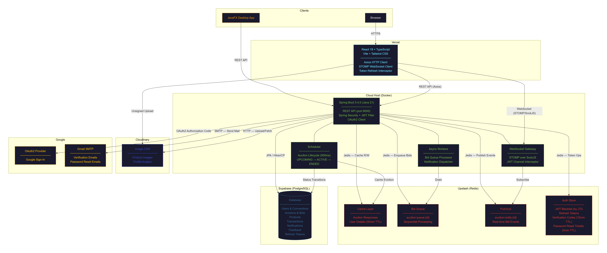

# 1. Introduction: Goal and Scope

**Project Name:** Bid Vault - Real Time Bidding Application  
**Group:** 7

### Links
* **Main Repository:** [https://github.com/lkishere2/BidVault](https://github.com/lkishere2/BidVault)
* **Deployment Repository:** [https://github.com/2cpk-fin/BidVault](https://github.com/2cpk-fin/BidVault)
* **Deployed Website:** [https://bid-vault-seven.vercel.app/](https://bid-vault-seven.vercel.app/)

### Goal
The primary objective of this project is to build a fully functional, highly resilient, and real-time auction and bidding service. The system is designed to provide a secure and seamless bidding experience across two distinct platforms: a Web Application and a Desktop Application.

### Scope
The scope of the project encompasses:
* A robust and highly secure Authentication & Authorization system featuring distinct roles (ADMIN and USER).
* A dual-interface approach: A dynamic web UI built with ReactTS and a Desktop UI built with JavaFX.
* A scalable RESTful API built with Spring Boot, structured around Domain-Driven Design (DDD).
* Real-time capabilities for bidding and notifications using WebSockets and Redis Pub/Sub.
* Cloud deployment using Docker containers, Vercel, and managed database services.

---

# 2. System Architecture

The application adopts a modern, distributed architecture to ensure scalability, real-time performance, and high availability.

### Architecture Description
The system follows a micro-service oriented approach within a monorepo structure, strictly adhering to Domain-Driven Design (DDD).
* **Client Layer:** Includes the Web Browser interacting with the React/Vite frontend hosted on Vercel, and a JavaFX Desktop application. Both communicate with the backend via REST APIs and WebSockets.
* **API Server (Spring Boot):** The core engine running on Docker. It contains:
  * **REST API:** Handles incoming HTTP requests, secured by a JWT Filter.
  * **WebSocket Gateway:** Manages real-time bidirectional communication using STOMP over SockJS.
  * **Scheduler & Async Workers:** Automates the auction lifecycle (UPCOMING -> ACTIVE -> ENDED) every 500ms, processes the bid queue, and dispatches notifications asynchronously to avoid blocking the main threads.
* **Caching & Message Broker (Upstash Redis):** Acts as the backbone for high performance. It caches auction responses, stores transient user sessions to prevent database bottlenecks, manages sequential bid queues to ensure data integrity during concurrent bidding, and powers the real-time Pub/Sub notification system.
* **Persistent Storage:** Supabase (PostgreSQL) is the main relational database storing all persistent state including Users, Auctions, Products, and Transactions.
* **Third-Party Integrations:** Cloudinary handles image hosting via CDN. Google provides OAuth2 authentication and SMTP services for email verification.

---

# 3. Features & Implementation Strategies

### 3.1. Authentication and Authorization
* **Feature:** Secure user registration, login, and password recovery.
* **Solution:** Dual login options (OAuth2 & Local). Local registration uses Spring Boot Mail and Redis to send and validate OTPs (15-minute TTL). The system uses JWT for stateless authentication and long-lived Refresh Tokens.
* **Reasoning:** OAuth2 significantly lowers the friction for onboarding. Using Redis for OTP validation ensures temporary codes do not bloat the primary PostgreSQL database.

### 3.2. Filter Chain Optimization
* **Feature:** Extremely fast request authorization.
* **Solution:** Implemented a lightweight version of `UserDetails` cached in Redis with a 30-minute TTL.
* **Reasoning:** In a real-time bidding application, traffic is incredibly high. By caching user authorities in Redis, the JWT filter skips querying the PostgreSQL database on every request, making the API blazingly fast and preventing DB connection pool exhaustion.

### 3.3. Money Management
* **Feature:** Secure wallet system for deposits and withdrawals.
* **Solution:** Requests are stored with a `PENDING` status. Administrators review requests on a dashboard and transition statuses to `SUCCESS` or `FAILED`.
* **Reasoning:** Manual administrative oversight is required for financial transactions to prevent fraud and ensure system integrity.

### 3.4. Auction & Product Management
* **Feature:** Creating products and launching auctions.
* **Solution:** Users manage their own isolated storage. When an auction is launched, the system automatically calculates minimum bid increments (+5%). The Auction Scheduler (running every 500ms) automatically transitions auction states without user intervention.
* **Reasoning:** Centralizing state transitions in a background scheduler guarantees that auctions start and end exactly on time, independent of client requests.

### 3.5. Real-Time Bidding, Concurrency, and Anti-Sniping
* **Feature:** Live bids, conflict-free concurrency handling, and sniper prevention.
* **Concurrency Solution:** When users place bids simultaneously, the requests are instantly pushed into a **Redis Queue**. Because Redis executes commands in a single-threaded, thread-safe manner, the bids are perfectly lined up in chronological order. A background **Async Worker** then continuously pulls bids from this queue one-by-one, validates them, and writes the successful bids to the PostgreSQL database.
* **Real-Time Pub/Sub:** After the worker successfully updates the database, it immediately publishes the new highest bid to a **Redis Pub/Sub** channel. The WebSocket Gateway listens to this channel and broadcasts the new price to all connected clients instantly.
* **Anti-Sniping Feature:** To prevent "auction sniping" (where a user places a winning bid in the final seconds to block counter-bids), the system includes a time-extension logic. If a valid bid is placed within the last two minutes of an auction's scheduled end time, the auction's end time is automatically extended, ensuring fair competition.
* **Reasoning:** Queuing bids eliminates database deadlocks and guarantees fair, sequential processing during intense bidding wars. The Pub/Sub model minimizes latency, while anti-sniping protects the integrity of the auction.

### 3.6. Social & Notification System
* **Feature:** Community engagement and instant alerts.
* **Following System:** Users can search and follow their favorite sellers through the community page.
* **Notification Broadcasting:** Leveraging the same Redis Pub/Sub and WebSocket infrastructure used for bidding, the system instantly notifies all followers whenever a seller launches a new auction. It also handles direct notifications (e.g., when a user gets a new follower) and system-wide admin broadcasts to all active users.

---

# 4. Work Division

The project was divided collaboratively based on individual strengths, ensuring all layers of the stack were developed with high quality.

| Team Member | Responsibilities |
| :--- | :--- |
| **Trần Vũ Duy Hưng** | • Designed the core system architecture and main features. • Architected the main relational database schema. • Implemented complex caching layers and queue systems using Redis to ensure high performance and concurrency handling. |
| **Vũ Long Khánh** | • Handled system security, implementing a highly robust Authentication & Authorization mechanism (JWT, OAuth2, Filter optimizations). • Collaborated on feature design with teammates. • Developed the dynamic, responsive frontend Web UI using ReactJS and Tailwind CSS. |
| **Nguyễn Hoàng Lâm** | • Conducted comprehensive testing for features utilizing JUnit and Mockito. • Developed the Desktop User Interface using JavaFX. • Participated in the implementation of backend RESTful APIs. |
| **Đinh Thái Hữu Khánh**| • Conducted comprehensive testing for features utilizing JUnit and Mockito. • Developed the Desktop User Interface using JavaFX. • Participated in the implementation of backend RESTful APIs. |
